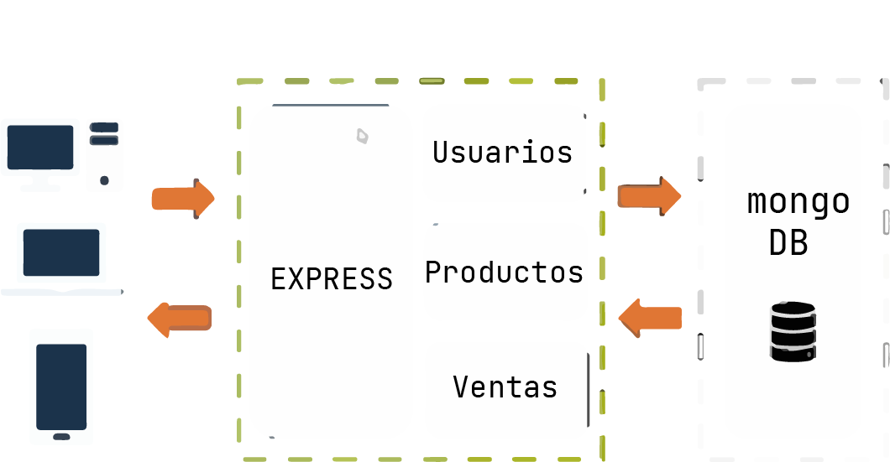
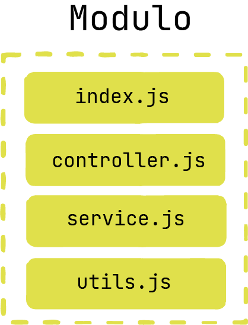

# Node-REST-API

### Technologies
<p align="center">
    
  
    
  
</p>

## Description
This is a REST API for a simple store management system. It allows you to create, read, update and delete products and users. It also allows you to generate a report of all products in an excel file.

<p align="center">
    
    
</p>

 
## Usage

Start the server: npm start
Open a web browser and navigate to http://localhost:3000

run the following command to install all the dependencies
```
npm install
```

run the following command to start the server
```
npm run dev
```

### env example
important to use **dotenv** to use the env variables

```env
PORT=3000
MONGO_URI=mongodb+srv://<username>:<password>@<cluster>/<database>?retryWrites=true&w=majority
MONGO_DB_NAME=<database>
```

## API Endpoints
* **/api/products**
    * **GET**: Get all products
    * **POST**: Create a new product

* **/api/products/:id**
    * **GET:** Get a single product by ID
    * **PUT:** Update a product by ID
    * **DELETE:** Delete a product by ID

*  **/api/products/report**
    * **GET:** Get a report of all products (Excel)
    ###### ⚠️ to get a report on postman use the toggle button and select the option "Send and download" and then send the request


* **/api/users**
    * **GET**: Get all users
    * **POST:** Create a new user

* **/api/users/:id**
    * **GET:** Get a single user by ID
    * **PUT:** Update a user by ID
    * **DELETE:** Delete a user by ID


# Database
This project uses MongoDB as the database (Mongo Atlas). The database connection is established in the database/index.js file. The database name is "node-rest-api" and the collection names are "products", "sales" and "users".

## Configuration
Configuration options can be set in the config.js file.


## Debugging
Debugging can be enabled by setting the DEBUG environment variable to "app:*". For example, on Linux or macOS, use the following command:
```
DEBUG=app:* npm start
```
On Windows, use the following command:
```
set DEBUG=app:* & npm start
```

## Testing
Install dev dependencies: npm install --dev
Run tests: npm test

## Resources
* [Node.js](https://nodejs.org/en/)
* [Express](https://expressjs.com/)
* [MongoDB](https://www.mongodb.com/)
* [Debug ](https://www.npmjs.com/package/debug)
* [excel4node ](https://www.npmjs.com/package/excel4node)
* [http-errors ](https://www.npmjs.com/package/http-errors)


## License
This project is licensed under the MIT License - see the LICENSE file for details.
 
